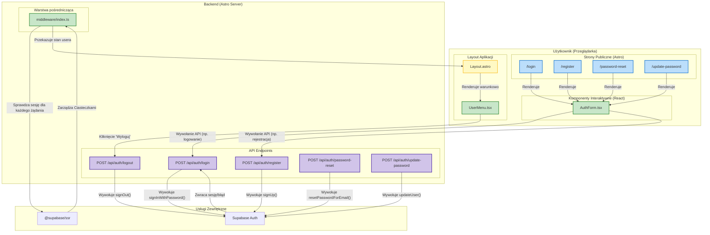

<architecture_analysis>

### 1. Lista komponentów i stron

Na podstawie analizy plików `auth-spec.md` i `prd.md` oraz struktury projektu, zidentyfikowałem następujące elementy, które wezmą udział w procesie autentykacji:

**Nowe Strony (Astro):**

- `/login`: Strona hostująca formularz logowania.
- `/register`: Strona hostująca formularz rejestracji.
- `/password-reset`: Strona hostująca formularz do inicjowania resetu hasła.
- `/update-password`: Strona do ustawiania nowego hasła po przejściu z linku mailowego.

**Nowe Komponenty (React):**

- `AuthForm.tsx`: Centralny, interaktywny komponent React do obsługi logiki formularzy logowania, rejestracji i resetowania hasła. Będzie renderowany po stronie klienta.
- `UserMenu.tsx`: Komponent wyświetlany w nagłówku po zalogowaniu, zawierający opcje "Ustawienia" i "Wyloguj".

**Modyfikowane Elementy:**

- `Layout.astro`: Główny layout aplikacji, który będzie warunkowo renderował `UserMenu` lub przyciski logowania/rejestracji w zależności od stanu autentykacji.
- `middleware/index.ts`: Oprogramowanie pośredniczące Astro do ochrony tras i zarządzania sesją użytkownika na podstawie tokenu w ciasteczkach.

**Logika Backendowa (Astro API Endpoints):**

- `POST /api/auth/login`: Endpoint do logowania.
- `POST /api/auth/register`: Endpoint do rejestracji.
- `POST /api/auth/logout`: Endpoint do wylogowywania.
- `POST /api/auth/password-reset`: Endpoint do inicjowania resetu hasła.
- `POST /api/auth/update-password`: Endpoint do aktualizacji hasła.

**Moduły Wspierające:**

- `Supabase Client`: Klient do komunikacji z Supabase Auth.
- `@supabase/ssr`: Biblioteka do zarządzania sesją po stronie serwera za pomocą ciasteczek.

### 2. Główne strony i ich komponenty

- Strona `/login` będzie zawierać komponent `AuthForm` w wariancie logowania.
- Strona `/register` będzie zawierać komponent `AuthForm` w wariancie rejestracji.
- Strona `/password-reset` będzie zawierać komponent `AuthForm` w wariancie resetowania hasła.
- Każda strona w aplikacji będzie używać `Layout.astro`, który w nagłówku wyświetli `UserMenu` (dla zalogowanych) lub linki do logowania (dla gości).

### 3. Przepływ danych

1.  Użytkownik wchodzi na stronę (np. `/login`).
2.  `Layout.astro` sprawdza stan autentykacji (przekazany z `middleware`).
3.  Strona `/login` renderuje komponent React `AuthForm`.
4.  Użytkownik wchodzi w interakcję z `AuthForm` (wpisuje dane, klika przyciski).
5.  `AuthForm` komunikuje się z odpowiednim endpointem Astro API (np. `POST /api/auth/login`).
6.  Endpoint API wywołuje metodę z klienta Supabase.
7.  Supabase wykonuje operację (np. loguje użytkownika) i zwraca wynik.
8.  Endpoint API obsługuje odpowiedź, ustawia ciasteczka sesji (`@supabase/ssr`) i zwraca odpowiedź do `AuthForm`.
9.  `AuthForm` na podstawie odpowiedzi przekierowuje użytkownika (np. na dashboard) lub wyświetla błąd.
10. Po przekierowaniu, `middleware` odczytuje nową sesję z ciasteczek i udostępnia dane użytkownika w `context.locals`, co pozwala `Layout.astro` na wyświetlenie `UserMenu`.

### 4. Opis funkcjonalności

- **Strony Astro (`/login`, `/register` itp.)**: Działają jako statyczne "skorupy", których jedynym zadaniem jest załadowanie odpowiedniego interaktywnego komponentu React.
- **`AuthForm.tsx`**: Sercem interakcji użytkownika. Zarządza stanem formularza, walidacją po stronie klienta i komunikacją z backendem.
- **`UserMenu.tsx`**: Zapewnia zalogowanemu użytkownikowi dostęp do ustawień i opcji wylogowania.
- **`Layout.astro`**: Odpowiada za spójny wygląd aplikacji i dynamiczne dostosowywanie UI nagłówka do stanu zalogowania.
- **`middleware/index.ts`**: Pełni rolę strażnika, chroniąc strony i dostarczając informacje o sesji do reszty aplikacji.
- **Endpointy API**: Stanowią most między frontendem a usługą Supabase, hermetyzując logikę autentykacji po stronie serwera.
  </architecture_analysis>

<mermaid_diagram>

</mermaid_diagram>
