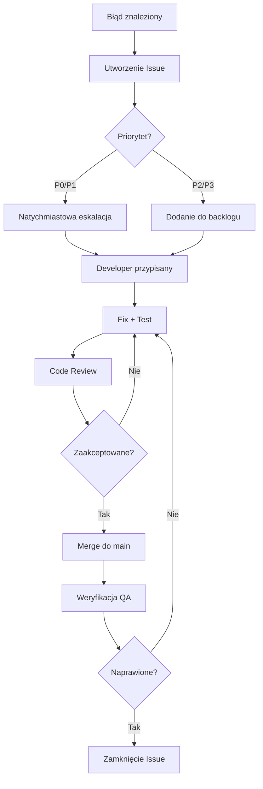

# Plan Testów - Kipio

## 1. Wprowadzenie i Cele Testowania

### 1.1. Cel Dokumentu

Niniejszy dokument określa kompleksową strategię testowania aplikacji Kipio - platformy do śledzenia metryk osobistych. Plan testów został opracowany w oparciu o architekturę monorepo wykorzystującą Astro, React, NestJS oraz Supabase.

### 1.2. Cele Testowania

- **Zapewnienie jakości**: Weryfikacja poprawności działania wszystkich funkcjonalności aplikacji
- **Bezpieczeństwo**: Walidacja mechanizmów autoryzacji i autentykacji (JWT, RLS)
- **Wydajność**: Potwierdzenie spełnienia wymagań wydajnościowych API i bazy danych
- **Stabilność**: Wykrycie i eliminacja błędów krytycznych przed wdrożeniem
- **Zgodność z wymaganiami**: Weryfikacja realizacji wymagań biznesowych

## 2. Zakres Testów

### 2.1. W Zakresie Testów

#### Backend (NestJS API)

- Testy jednostkowe serwisów i kontrolerów
- Testy integracyjne z Supabase
- Testy endpointów REST API
- Walidacja DTO i transformacji danych
- Mechanizmy autentykacji (JWT Strategy, Guards)
- Logika biznesowa (limity trackerów, walidacja wartości)

#### Frontend (Astro + React)

- Testy komponentów React
- Walidacja formularzy (React Hook Form + Zod)
- Przepływ autentykacji użytkownika
- Middleware i ochrona tras
- Integracja z API

#### Baza Danych (Supabase PostgreSQL)

- Migracje i schemat bazy danych
- Row Level Security (RLS) policies
- Triggery i funkcje PL/pgSQL
- Indeksy i wydajność zapytań
- Soft delete i integralność danych

### 2.2. Poza Zakresem Testów

- Infrastruktura hostingowa (Vercel, DigitalOcean)
- Zewnętrzne usługi Supabase Auth
- Narzędzia deweloperskie (ESLint, Prettier)
- Dokumentacja projektowa

## 3. Typy Testów do Przeprowadzenia

### 3.1. Testy Jednostkowe (Unit Tests)

**Technologia**: Jest 30 (Backend), Vitest (Frontend - planowane)

**Zakres**:

- **NestJS Services**:
  - `TrackersService`: CRUD operacje, walidacja limitów, reorderowanie
  - `EntriesService`: Tworzenie wpisów, walidacja wartości, zapytania z filtrowaniem
  - `DashboardService`: Agregacja danych, kalkulacja trendów, sparklines
  - `TemplatesService`: Pobieranie szablonów, pakietów
  - `AuthService`: Logowanie, rejestracja, reset hasła

- **NestJS Controllers**:
  - `TrackersController`: Routing, walidacja parametrów, Response DTO
  - `EntriesController`: Obsługa zapytań z paginacją
  - `DashboardController`: Parametry zapytań (date ranges)

- **DTO Validation**:
  - `CreateTrackerDto`: Walidacja data_type, config, color (hex)
  - `CreateEntryDto`: Walidacja wartości według typu trackera
  - Zapytania z paginacją i filtrami

- **React Components** (do implementacji):
  - `AuthForm`: Walidacja formularzy, obsługa błędów
  - `TrackerCard`: Renderowanie różnych typów danych
  - `EntryForm`: Dynamiczna walidacja według typu

**Pokrycie docelowe**: ≥80% dla kodu biznesowego

### 3.2. Testy Integracyjne (Integration Tests)

**Zakres**:

**Backend + Supabase**:

- Przepływ tworzenia trackera z weryfikacją limitu w bazie
- Zapisywanie i pobieranie wpisów z różnymi typami danych
- Mechanizmy soft delete (deleted_at)
- Współpraca JWT Strategy z Supabase Auth
- Rate limiting (@nestjs/throttler)

**Frontend + Backend API**:

- Logowanie użytkownika przez formularz → Supabase Auth → JWT
- Tworzenie trackera przez UI → NestJS API → Supabase
- Pobieranie dashboardu z agregacjami

**Row Level Security**:

- Izolacja danych użytkowników
- Uprawnienia do udostępnionych trackerów (read/write)
- Blokada dostępu do cudzych zasobów

### 3.3. Testy End-to-End (E2E)

**Technologia**: Playwright (do wdrożenia)

**Scenariusze**:

1. **Pełny przepływ użytkownika**:
   - Rejestracja → Onboarding → Tworzenie pierwszego trackera → Dodanie wpisu → Dashboard

2. **Zarządzanie trackerami**:
   - Tworzenie trackera typu "scale" (1-10)
   - Edycja koloru i ikony
   - Zmiana kolejności (drag & drop w przyszłości)
   - Dezaktywacja trackera

3. **Wpisy danych**:
   - Dodanie wpisu z backdating (recorded_at w przeszłości)
   - Edycja istniejącego wpisu
   - Usunięcie wpisu

4. **Sesje i bezpieczeństwo**:
   - Wylogowanie i wygaśnięcie JWT
   - Próba dostępu do chronionej strony bez logowania
   - Refresh tokenu przy długiej sesji

### 3.4. Testy Wydajnościowe (Performance Tests)

**Narzędzia**: k6, Apache JMeter

**Obszary**:

**API Endpoints**:

- Czas odpowiedzi < 200ms dla GET /api/trackers
- Czas odpowiedzi < 500ms dla POST /api/entries (z walidacją)
- Throughput: 100 req/s na endpoint dashboardu

**Baza Danych**:

- Czas wykonania zapytania o wpisy z indeksami: < 50ms
- Agregacje (sparkline 30 dni): < 100ms
- Skalowalność do 100,000 wpisów na użytkownika

**Frontend**:

- First Contentful Paint (FCP) < 1.5s
- Time to Interactive (TTI) < 3s
- Lighthouse Performance Score ≥ 90

### 3.5. Testy Bezpieczeństwa (Security Tests)

**Obszary**:

**Autentykacja i Autoryzacja**:

- Próby dostępu z nieważnym/wygasłym JWT → 401 Unauthorized
- Próby modyfikacji cudzych trackerów → 403 Forbidden
- SQL Injection w parametrach zapytań
- XSS w polach tekstowych (value_text)

**Row Level Security**:

- Weryfikacja polityk RLS: użytkownik A nie widzi danych użytkownika B
- Próby obejścia RLS przez manipulację user_id w request
- Testy uprawnień do udostępnionych trackerów

**Rate Limiting**:

- Blokada po przekroczeniu 100 req/h na API token
- Throttling na endpoint /api/auth/login

**Hashing i Szyfrowanie**:

- API tokeny przechowywane jako SHA-256 hash
- Hasła użytkowników zarządzane przez Supabase Auth

### 3.6. Testy Regresyjne

**Trigger Events**:

- Po każdym merge do `main`
- Przed każdym release
- Po modyfikacji migracji bazy danych

**Zakres**:

- Pełny suite testów jednostkowych i integracyjnych
- Krytyczne E2E (rejestracja, logowanie, CRUD trackera)
- Weryfikacja kompatybilności z poprzednią wersją API

## 4. Scenariusze Testowe dla Kluczowych Funkcjonalności

### 4.1. Autentykacja Użytkownika

**Scenariusz 1: Rejestracja Nowego Użytkownika**

- **Warunki początkowe**: Użytkownik nie ma konta
- **Kroki**:
  1. Nawigacja do `/register`
  2. Wypełnienie formularza (email, hasło)
  3. Walidacja: hasło min. 8 znaków
  4. Submit → POST `/api/auth/register`
  5. Weryfikacja: profil utworzony w tabeli `profiles`
  6. Weryfikacja: email weryfikacyjny wysłany (Supabase)
- **Oczekiwany rezultat**: Użytkownik przekierowany do `/onboarding`, sesja aktywna

**Scenariusz 2: Logowanie z Nieprawidłowym Hasłem**

- **Kroki**:
  1. POST `/api/auth/login` z błędnym hasłem
  2. Weryfikacja: odpowiedź 401 Unauthorized
  3. UI: komunikat "Nieprawidłowe dane logowania"
- **Oczekiwany rezultat**: Brak utworzenia sesji

### 4.2. Zarządzanie Trackerami

**Scenariusz 3: Tworzenie Trackera z Limitem**

- **Warunki początkowe**: Użytkownik ma 49/50 trackerów
- **Kroki**:
  1. POST `/api/trackers` z nowym trackerem
  2. Weryfikacja: tracker utworzony, `display_order` = 49
  3. Próba utworzenia 51. trackera
  4. Weryfikacja: 403 Forbidden, błąd "Tracker limit reached"
- **Oczekiwany rezultat**: Przestrzeganie limitu z tabeli `profiles.trackers_limit`

**Scenariusz 4: Soft Delete Trackera**

- **Kroki**:
  1. DELETE `/api/trackers/{id}`
  2. Weryfikacja: `deleted_at` ustawiony na NOW()
  3. GET `/api/trackers` → tracker nie pojawia się w liście
  4. Zapytanie do bazy: rekord nadal istnieje
- **Oczekiwany rezultat**: Tracker ukryty, dane zachowane (GDPR retention)

### 4.3. Wpisy Danych (Entries)

**Scenariusz 5: Dodanie Wpisu Typu Scale z Walidacją**

- **Warunki początkowe**: Tracker typu `scale`, config `{min: 1, max: 10}`
- **Kroki**:
  1. POST `/api/entries` z `value_number = 5` → sukces
  2. POST `/api/entries` z `value_number = 15` → 422 Unprocessable Entity
  3. Weryfikacja: trigger `validate_entry_value` zablokował zapis
- **Oczekiwany rezultat**: Tylko wartości w zakresie 1-10 zaakceptowane

**Scenariusz 6: Backdating Wpisu**

- **Kroki**:
  1. POST `/api/entries` z `recorded_at = "2026-01-15T10:00:00Z"` (przeszłość)
  2. Weryfikacja: wpis zapisany z `recorded_at` z przeszłości
  3. Dashboard: wpis pojawia się we właściwym miejscu na timeline
- **Oczekiwany rezultat**: Możliwość dodawania historycznych danych

### 4.4. Dashboard i Agregacje

**Scenariusz 7: Kalkulacja Trendu na Sparkline**

- **Warunki początkowe**: Tracker z 30 wpisami z ostatnich 30 dni
- **Kroki**:
  1. GET `/api/dashboard?days=7`
  2. Weryfikacja: `sparkline_data` zawiera 7 wartości
  3. Weryfikacja: `trend.direction` = "up/down/stable"
  4. Weryfikacja: `trend.percentage` kalkulowany poprawnie
- **Oczekiwany rezultat**: Dane agregowane i trend obliczony algorytmem z `dashboard.service.ts`

### 4.5. Row Level Security (RLS)

**Scenariusz 8: Izolacja Danych Między Użytkownikami**

- **Warunki początkowe**: User A i User B mają własne trackery
- **Kroki**:
  1. User A loguje się, pobiera JWT
  2. GET `/api/trackers` z tokenem User A
  3. Weryfikacja: tylko trackery User A zwrócone
  4. Próba User A: GET `/api/trackers/{userB_tracker_id}`
  5. Weryfikacja: 403 Forbidden lub 404 Not Found
- **Oczekiwany rezultat**: Polityka RLS `trackers_select_own` blokuje dostęp

**Scenariusz 9: Udostępniony Tracker z Uprawnieniami Read**

- **Kroki**:
  1. User A udostępnia tracker User B z `permission = 'read'`
  2. User B: GET `/api/trackers/{shared_tracker_id}` → sukces
  3. User B: POST `/api/entries` dla tego trackera → 403 Forbidden
- **Oczekiwany rezultat**: Polityka RLS `entries_insert_shared_write` blokuje zapis

## 5. Środowisko Testowe

### 5.1. Środowiska

| Środowisko     | Cel                       | Baza Danych              | API URL                         |
| -------------- | ------------------------- | ------------------------ | ------------------------------- |
| **Local**      | Rozwój, testy jednostkowe | Supabase Local (Docker)  | `http://localhost:3000`         |
| **Staging**    | Testy integracyjne, E2E   | Supabase Staging Project | `https://api-staging.kipio.app` |
| **Production** | Smoke testy po wdrożeniu  | Supabase Production      | `https://api.kipio.app`         |

### 5.2. Konfiguracja Lokalnego Środowiska

**Wymagania**:

- Node.js 20+
- pnpm 8+
- Docker Desktop (dla Supabase Local)

**Setup**:

```bash
# Instalacja zależności
pnpm install

# Uruchomienie Supabase lokalnie
pnpm supabase:start

# Zaaplikowanie migracji
pnpm supabase:db:reset

# Uruchomienie testów
pnpm --filter @kipio/api test          # Backend unit tests
pnpm --filter @kipio/web test          # Frontend tests (do wdrożenia)
```

### 5.3. Dane Testowe

**Seed Data**:

- 3 użytkowników testowych (test1@kipio.app, test2@kipio.app, admin@kipio.app)
- 10 trackerów różnych typów (number, scale, boolean, text)
- Template packages: "Health & Fitness", "Productivity"
- 100 przykładowych wpisów z ostatnich 30 dni

**Generowanie**:

```sql
-- Skrypt: supabase/seed.sql
INSERT INTO auth.users (email, encrypted_password) VALUES
  ('test1@kipio.app', '$2a$10$...'),
  ('test2@kipio.app', '$2a$10$...');
```

## 6. Narzędzia do Testowania

### 6.1. Narzędzia Backend (NestJS)

| Narzędzie           | Wersja         | Zastosowanie                                        |
| ------------------- | -------------- | --------------------------------------------------- |
| **Jest**            | 30.2.0         | Framework testowy, testy jednostkowe i integracyjne |
| **@nestjs/testing** | 11.1.10        | Test utilities dla NestJS (TestingModule)           |
| **ts-jest**         | 29.4.6         | Transpilacja TypeScript w testach                   |
| **supertest**       | - (do dodania) | Testy HTTP dla kontrolerów                          |

**Konfiguracja** (`apps/api/package.json`):

```json
{
  "jest": {
    "moduleFileExtensions": ["js", "json", "ts"],
    "rootDir": "src",
    "testRegex": ".*\\.spec\\.ts$",
    "transform": { "^.+\\.(t|j)s$": "ts-jest" },
    "collectCoverageFrom": ["**/*.(t|j)s"],
    "coverageDirectory": "../coverage",
    "testEnvironment": "node"
  }
}
```

### 6.2. Narzędzia Frontend (Astro + React)

| Narzędzie                       | Status       | Zastosowanie                              |
| ------------------------------- | ------------ | ----------------------------------------- |
| **Vitest**                      | Do wdrożenia | Testy jednostkowe React komponentów       |
| **@testing-library/react**      | Do wdrożenia | Testowanie komponentów z user perspective |
| **@testing-library/user-event** | Do wdrożenia | Symulacja interakcji użytkownika          |

### 6.3. Narzędzia E2E

| Narzędzie            | Status       | Zastosowanie                          |
| -------------------- | ------------ | ------------------------------------- |
| **Playwright**       | Do wdrożenia | Testy E2E, automatyzacja przeglądarki |
| **@playwright/test** | Do wdrożenia | Test runner dla Playwright            |

### 6.4. Narzędzia Wydajności i Bezpieczeństwa

| Narzędzie              | Zastosowanie                  |
| ---------------------- | ----------------------------- |
| **k6**                 | Load testing API              |
| **Lighthouse CI**      | Audyt wydajności frontendu    |
| **OWASP ZAP**          | Skanowanie bezpieczeństwa     |
| **pg_stat_statements** | Analiza wydajności PostgreSQL |

### 6.5. CI/CD Integration

**GitHub Actions** (`.github/workflows/test.yml`):

```yaml
name: Tests
on: [push, pull_request]
jobs:
  test-backend:
    runs-on: ubuntu-latest
    steps:
      - uses: actions/checkout@v4
      - uses: pnpm/action-setup@v2
      - run: pnpm install
      - run: pnpm --filter @kipio/api test:cov
      - uses: codecov/codecov-action@v3
```

## 7. Harmonogram Testów

### 7.1. Faza Rozwoju (Ongoing)

| Aktywność                  | Częstotliwość       | Odpowiedzialny |
| -------------------------- | ------------------- | -------------- |
| Testy jednostkowe          | Przed każdym commit | Developerzy    |
| Lokalne testy integracyjne | Przed PR            | Developerzy    |
| Code review z testami      | Przy każdym PR      | Tech Lead      |

### 7.2. Przed Release

| Dzień   | Aktywność                                    | Czas | Zespół            |
| ------- | -------------------------------------------- | ---- | ----------------- |
| **D-7** | Freeze nowych feature'ów, focus na bugfixach | -    | Dev Team          |
| **D-5** | Pełny suite testów regresyjnych              | 4h   | QA + Dev          |
| **D-3** | Testy E2E na staging                         | 6h   | QA                |
| **D-2** | Testy wydajnościowe (k6)                     | 3h   | DevOps            |
| **D-1** | Audyt bezpieczeństwa (OWASP ZAP)             | 2h   | Security Engineer |
| **D-0** | Smoke testy na production                    | 1h   | QA                |

### 7.3. Post-Release

- **D+1**: Monitoring błędów (Sentry, Logs)
- **D+7**: Retrospektywa testów, aktualizacja dokumentacji

## 8. Kryteria Akceptacji Testów

### 8.1. Kryteria Wejścia (Entry Criteria)

- Kod przeszedł code review
- Brak błędów kompilacji/budowania
- Lokalne testy jednostkowe wykonane przez developera
- Środowisko testowe (staging) dostępne i zaktualizowane

### 8.2. Kryteria Wyjścia (Exit Criteria)

**Must-Have (Blokujące Release)**:

- ✅ Wszystkie testy jednostkowe przechodzą (0 failures)
- ✅ Pokrycie kodu testami ≥ 75% dla backendu
- ✅ 0 błędów krytycznych (severity: critical)
- ✅ Testy RLS: 100% polityk zweryfikowanych
- ✅ Testy autentykacji: wszystkie scenariusze pozytywne i negatywne

**Should-Have (Ważne, ale negocjowalne)**:

- ✅ Pokrycie kodu ≥ 80%
- ✅ Maksymalnie 3 błędy średnie (severity: medium)
- ✅ Wydajność: 95% requestów < 200ms
- ✅ Lighthouse Performance Score ≥ 85

**Nice-to-Have**:

- Testy E2E pokrywają 80% user flows
- Dokumentacja testów aktualna
- Brak błędów niskiej wagi (severity: low)

### 8.3. Metryki Jakości

| Metryka                        | Cel            | Metoda Pomiaru             |
| ------------------------------ | -------------- | -------------------------- |
| **Code Coverage**              | ≥80%           | Jest `--coverage`, Codecov |
| **Test Pass Rate**             | 100%           | CI/CD Pipeline             |
| **Defect Density**             | <1 bug/100 LOC | Issue Tracker Analysis     |
| **Mean Time To Detect (MTTD)** | <24h           | Monitoring + Sentry        |
| **API Response Time (p95)**    | <300ms         | k6, DataDog                |

## 9. Role i Odpowiedzialności w Procesie Testowania

### 9.1. Zespół

| Rola            | Odpowiedzialności                                                                                                              | Ilość Osób |
| --------------- | ------------------------------------------------------------------------------------------------------------------------------ | ---------- |
| **Developer**   | - Pisanie testów jednostkowych<br>- Lokalne testy przed PR<br>- Fixowanie błędów znalezionych w testach                        | 2-3        |
| **QA Engineer** | - Tworzenie test planów<br>- Wykonywanie testów manualnych E2E<br>- Automatyzacja testów (Playwright)<br>- Raportowanie błędów | 1          |
| **Tech Lead**   | - Code review z uwzględnieniem testów<br>- Nadzór nad metrykami pokrycia<br>- Decyzje go/no-go przed release                   | 1          |
| **DevOps**      | - Konfiguracja CI/CD<br>- Testy wydajnościowe (k6)<br>- Monitoring środowisk testowych                                         | 1          |

### 9.2. Macierz RACI

| Aktywność           | Developer | QA       | Tech Lead | DevOps   |
| ------------------- | --------- | -------- | --------- | -------- |
| Testy jednostkowe   | **R, A**  | C        | I         | -        |
| Testy integracyjne  | **R**     | C        | **A**     | I        |
| Testy E2E           | C         | **R, A** | I         | C        |
| Testy wydajności    | I         | C        | I         | **R, A** |
| Raportowanie błędów | C         | **R**    | **A**     | I        |
| Decyzja release     | C         | C        | **A**     | I        |

_R - Responsible, A - Accountable, C - Consulted, I - Informed_

## 10. Procedury Raportowania Błędów

### 10.1. Klasyfikacja Błędów

| Priorytet         | Opis                                     | SLA Resolution | Przykład                                                               |
| ----------------- | ---------------------------------------- | -------------- | ---------------------------------------------------------------------- |
| **P0 - Critical** | Aplikacja nie działa, utrata danych      | 4h             | - Nie można się zalogować<br>- Utrata wpisów po zapisie                |
| **P1 - High**     | Funkcja kluczowa nie działa              | 24h            | - Dashboard nie ładuje trackerów<br>- Błąd 500 przy tworzeniu trackera |
| **P2 - Medium**   | Funkcja działa częściowo lub z obejściem | 72h            | - Błędna kalkulacja trendu<br>- Problem z UX na mobile                 |
| **P3 - Low**      | Kosmetyczne, nie wpływa na działanie     | Next sprint    | - Błąd w tekście<br>- Nieprawidłowe wyrównanie CSS                     |

### 10.2. Szablon Zgłoszenia Błędu (GitHub Issue)

```markdown
## 🐛 Opis Błędu

[Krótki, jasny opis problemu]

## 📋 Kroki do Reprodukcji

1. Zaloguj się jako `test1@kipio.app`
2. Przejdź do `/trackers/new`
3. Wypełnij formularz...
4. Kliknij "Zapisz"

## ✅ Oczekiwane Zachowanie

Tracker powinien zostać utworzony i pojawić się na liście.

## ❌ Obecne Zachowanie

Błąd 422 Unprocessable Entity, tracker nie został utworzony.

## 🖼️ Screenshoty/Logi
```

POST /api/trackers 422
{"message": "Validation failed", "errors": [...]}

```

## 🌍 Środowisko
- **Środowisko**: Staging
- **Przeglądarka**: Chrome 120
- **OS**: Windows 11
- **User ID**: `123e4567-...`

## 🏷️ Severity
P1 - High

## 🔗 Powiązane
- Related to #123
- Blocked by #456
```

### 10.3. Workflow Obsługi Błędów



### 10.4. Narzędzia do Trackingu

- **GitHub Issues**: Primarne narzędzie do raportowania i trackingu
- **Sentry**: Automatyczne przechwytywanie błędów runtime (production)
- **Slack Channel #bugs**: Szybka komunikacja o critical issues
- **Linear** (opcjonalnie): Bardziej zaawansowany project management

---

## Podsumowanie

Niniejszy plan testów zapewnia kompleksowe podejście do jakości aplikacji Kipio, uwzględniając specyfikę architektury monorepo z NestJS i Supabase. Kluczowe obszary to:

1. **Mocne pokrycie testami jednostkowymi** - szczególnie logiki biznesowej (trackers, entries, RLS)
2. **Weryfikacja bezpieczeństwa** - JWT, RLS policies, rate limiting
3. **Testy wydajnościowe** - agregacje dashboardu, indeksy bazy danych
4. **Automatyzacja w CI/CD** - GitHub Actions zapewniają continuous testing

Plan jest dokumentem żywym i powinien być aktualizowany wraz z rozwojem projektu.

**Wersja**: 1.0  
**Data ostatniej aktualizacji**: 2026-02-01  
**Autorzy**: QA Team, Tech Lead
